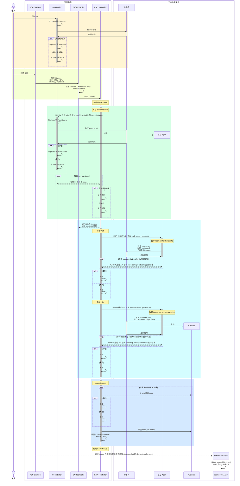

```mermaid
sequenceDiagram

actor 用户
box 管控集群
    participant KSC controller
    participant SI controller
    participant CAPI controller
    participant KSPH controller
end

rect rgb(255, 245, 212)
    用户 ->>+ SI controller: 创建 SI
    SI controller ->> SI controller: SI phase 变 Initializing
    SI controller ->>+ 物理机: 执行初始化
    物理机 ->>- SI controller: 返回结果
    alt 初始化成功
        SI controller ->> SI controller: SI phase 变 Available
    else 初始化失败
        SI controller ->>- SI controller: SI phase 变 Error
    end
end

rect rgb(245, 255, 212)
    用户 ->> KSC controller: 创建 KSC
    KSC controller ->>+ CAPI controller: 创建 Cluster、<br/>KCP、MD、KCT、<br/>KSPHC、KSPHMT
    CAPI controller ->> CAPI controller: 创建 Machine、KubeadmConfig，<br/>bootstrap secret
    CAPI controller ->>- KSPH controller: 创建 KSPHM
    activate KSPH controller
end

note over KSPH controller: 开始创建 KSPHM

rect rgb(212, 255, 228)
    activate KSPH controller
    note over KSPH controller: 关联 serverInstance
    KSPH controller ->>+ SI controller: KSPHM 通过 label 关联 phase 为 Available 的 serverInstance
    SI controller ->> SI controller: SI phase 变 Provisioning
    SI controller ->>+ 物理机: 执行 provider init
    create participant 独立 Agent
    SI controller ->> 独立 Agent: 拉起
    物理机 ->>- SI controller: 返回结果
    alt 成功
        SI controller ->> SI controller: SI phase 变 Provisioned
    else 失败
        SI controller ->>- SI controller: SI phase 变 Error
    end
    loop 等待 SI Provisioned
        KSPH controller -->> SI controller: KSPHM 查询 SI phase
        SI controller -->> KSPH controller: 
    end
    alt Provisioned
        KSPH controller ->> KSPH controller: 关联成功
    else Error
        KSPH controller ->> KSPH controller: 关联失败
    end
    deactivate KSPH controller
end

rect rgb(212, 253, 255)
    KSPH controller -->> CAPI controller: KSPHM 从 Machine<br/>获取 bootstrap 数据
    activate KSPH controller
    note over KSPH controller: 配置节点
    KSPH controller ->>+ 独立 Agent: KSPHM 通过 API 下发 ksph-config HostConfig
    note over 独立 Agent: 执行 ksph-config HostConfig
    独立 Agent ->>+ 物理机: 设置 hostname、<br/>配置 containerd、<br/>安装 K8s binary
    物理机 ->>- 独立 Agent: 返回结果
    deactivate 独立 Agent
    loop 等待 ksph-config HostConfig 执行完成
        KSPH controller -->> 独立 Agent: KSPHM 通过 API 查询 ksph-config HostConfig 执行结果
        独立 Agent -->> KSPH controller: 
    end
    alt 成功
        KSPH controller ->> KSPH controller: 继续
    else 失败
        KSPH controller ->> KSPH controller: 失败
    end
    deactivate KSPH controller

    activate KSPH controller
    note over KSPH controller: 启动 K8s
    KSPH controller ->>+ 独立 Agent: KSPHM 通过 API 下发 bootstrap HostOperationJob
    Note over 独立 Agent: 执行 bootstrap HostOperationJob
    独立 Agent ->>+ 物理机: 写入 kubeadm.yaml，<br/>执行 kubeadm init/join 命令
    create participant K8s node
    独立 Agent ->> K8s node: 启动
    物理机 ->>- 独立 Agent: 返回结果
    deactivate 独立 Agent
    loop 等待 bootstrap HostOperationJob 执行完成
        KSPH controller -->> 独立 Agent: KSPHM 通过 API 查询 bootstrap HostOperationJob 执行结果
        独立 Agent -->> KSPH controller: 
    end
    alt 成功
        KSPH controller ->> KSPH controller: 继续
    else 失败
        KSPH controller ->> KSPH controller: 失败
    end
    deactivate KSPH controller
end

rect rgb(212, 233, 255)
    activate KSPH controller
    note over KSPH controller: reconcile node
    loop 等待 K8s node 被创建
        KSPH controller -->> K8s node: 从 K8s 获取 node
    end
    alt 成功
        KSPH controller ->> KSPH controller: 继续
    else 失败
        KSPH controller ->> KSPH controller: 失败
    end
    KSPH controller ->> K8s node: 设置 node providerID
    KSPH controller ->> KSPH controller: 设置 KSPHM providerID，<br/>KSPHM ready
    deactivate KSPH controller
end

note over KSPH controller: 创建 KSPHM 完成
deactivate KSPH controller

create participant daemonSet Agent
KSC controller -->> daemonSet Agent: 通过 Addon 在工作负载集群中部署 daemomnSet 的 sks-host-config-agent
daemonSet Agent ->> daemonSet Agent: 将独立 Agent 所执行过的<br/>HostConfig 生成 CR

box 工作负载集群
    participant 物理机
    participant 独立 Agent
    participant K8s node
    participant daemonSet Agent
end

```
